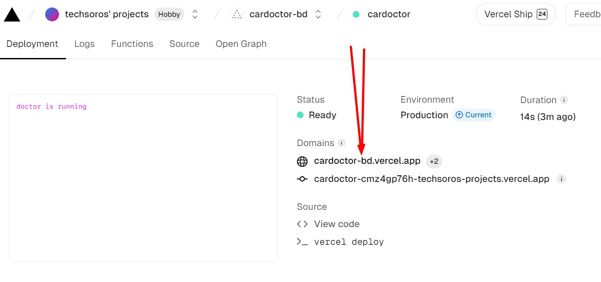

# JWT  --> JSON WEB TOKEN
 ### steps for server side
 -  install jsonwebtoken `npm install jsonwebtoken` [jwt io documentation](https://github.com/auth0/node-jsonwebtoken)
  **import**
 - `const jwt = require('jsonwebtoken')`
 - `const cookieParser = require('cookie-parser')`
  ```  
   app.post('/jwt', async(req, res ) => {
            const user = req.body;
            console.log(user)
            // create a token or generate a token
            const token = jwt.sign(user,process.env.ACCESS_TOKEN_SECRET,{expiresIn:'1h'})

            res
            // set in cookies
            .cookie('token',token,{
                httpOnly:true,
                secure:false, 
            })
            .send({success:true})
        }) 
 ```
-  
```
// middleware
app.use(cors({
    origin: ['http://localhost:5173'],
    credentials:true
}));

app.use(cookieParser())

```
 
 - jst.sign(payload, secret,{expiresIn:})
 - send token to client

 ### how to store token in the client side
  1. merory  ----> ok type
  2. local storage ---> ok type (XSS)
  3. cookies: http only
    - 
```
  .cookie('token',token,{
                httpOnly: true,
                secure:false
            })
```

## steps in client side
  1. client side axios setting 
  `axios.post('http://localhost:5000/jwt', user, {withCredentials: true})`

  ## how to genarate secret
  ```
  1. node
  2. > require('crypto').randomBytes(64).toString('hex')
  
   ```
**to send cookies form client side make sure you added withCredientials true**


  ### resorces
  - [expres cookie parse](https://expressjs.com/en/resources/middleware/cookie-parser.html)

  - jwt
  - how to set cookies in express js
  - search(why should i put jwt token in http only cookie. im using express how can i set it to the cookie and send)


# deployment process


## Server Deployment steps

1. comment await commands outside api methods for solving gateway timeout error

```js
//comment following commands
await client.connect();
await client.db("admin").command({ ping: 1 });
```

2. create vercel.json file for configuring server

```json
{
  "version": 2,
  "builds": [
    {
      "src": "index.js",
      "use": "@vercel/node"
    }
  ],
  "routes": [
    {
      "src": "/(.*)",
      "dest": "index.js",
      "methods": ["GET", "POST", "PUT", "PATCH", "DELETE", "OPTIONS"]
    }
  ]
}
```

3. Add Your production domains to your cors configuration

```js
//Must remove "/" from your production URL
app.use(
  cors({
    origin: [
      "http://localhost:5173",
      "https://cardoctor-bd.web.app",
      "https://cardoctor-bd.firebaseapp.com",
    ],
    credentials: true,
  })
);
```

4. Let's create a cookie options for both production and local server

```js
const cookieOptions = {
  httpOnly: true,
  secure: process.env.NODE_ENV === "production",
  sameSite: process.env.NODE_ENV === "production" ? "none" : "strict",
};
//localhost:5000 and localhost:5173 are treated as same site.  so sameSite value must be strict in development server.  in production sameSite will be none
// in development server secure will false .  in production secure will be true
```

## now we can use this object for cookie option to modify cookies

```js
//creating Token
app.post("/jwt", logger, async (req, res) => {
  const user = req.body;
  console.log("user for token", user);
  const token = jwt.sign(user, process.env.ACCESS_TOKEN_SECRET);

  res.cookie("token", token, cookieOptions).send({ success: true });
});

//clearing Token
app.post("/logout", async (req, res) => {
  const user = req.body;
  console.log("logging out", user);
  res
    .clearCookie("token", { ...cookieOptions, maxAge: 0 })
    .send({ success: true });
});
```

5. Deploy to Vercel

```bash

vercel
vercel --prod
- After completed the deployment . click on inspect link and copy the production domain
- setup your environment variables in vercel
- check your public API
```



# Server Deployment Done

 